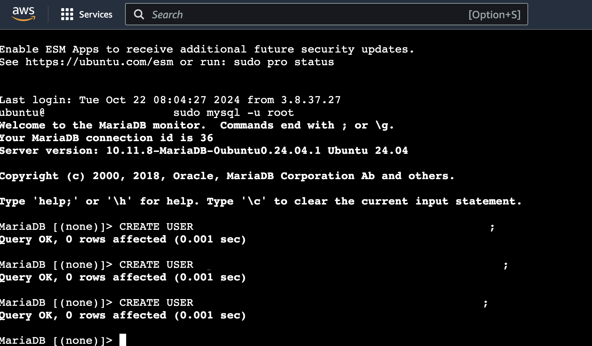
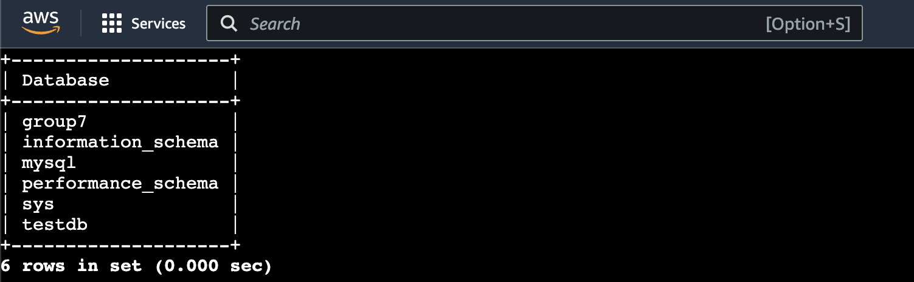
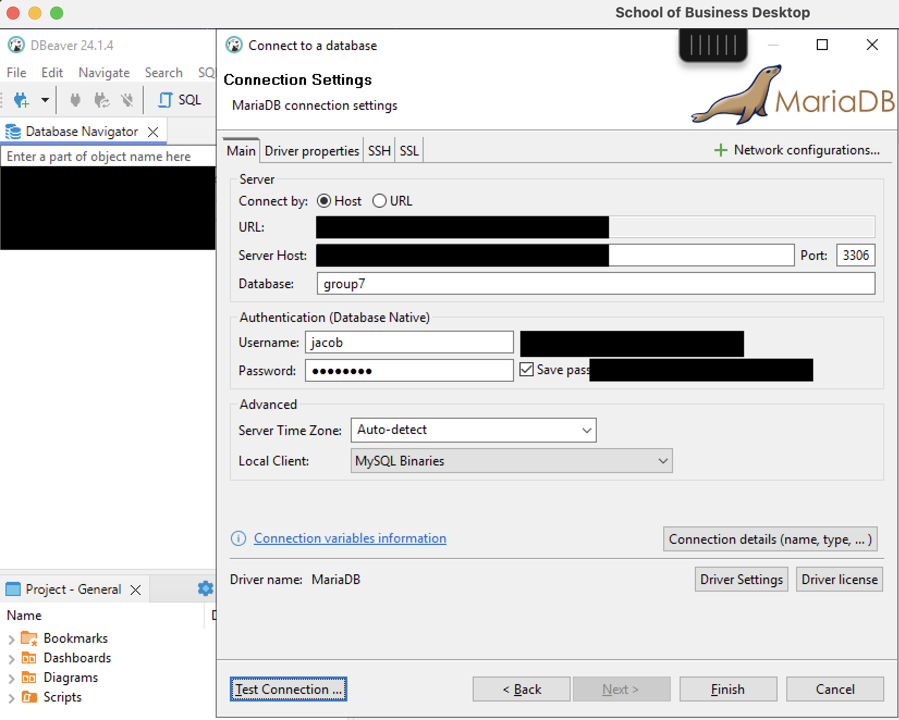

Instructions: Setting Up an EC2 Instance with MariaDB and Connecting via DBeaver
================================================================================

This guide provides step-by-step instructions to set up an Amazon EC2 instance with MariaDB, configure the necessary security settings, and connect to the database using DBeaver.

* * * * *

Table of Contents
-----------------

1.  [Prerequisites](#prerequisites)
2.  [Launch an EC2 Instance](#1-launch-an-ec2-instance)
3.  [Install MariaDB on the EC2 Instance](#2-install-mariadb-on-the-ec2-instance)
4.  [Configure MariaDB for Remote Access](#3-configure-mariadb-for-remote-access)
5.  [Adjust Security Group Settings](#4-adjust-security-group-settings)
6.  [Configure the EC2 Instance Firewall](#5-configure-the-ec2-instance-firewall)
7.  [Connect to MariaDB Using DBeaver](#6-connect-to-mariadb-using-dbeaver)
8.  [Troubleshooting Connectivity Issues](#7-troubleshooting-connectivity-issues)
9.  [Security Best Practices](#8-security-best-practices)
10. [Additional Tips](#9-additional-tips)
11. [Summary](#summary)

* * * * *

Prerequisites
-------------

-   **AWS Account**: Access to the AWS Management Console.
-   **SSH Key Pair**: An existing key pair or create a new one during the EC2 setup.
-   **DBeaver**: Installed on your local machine.
-   **Terminal Access**: Command-line interface on your local machine.

* * * * *

1\. Launch an EC2 Instance
--------------------------

### Step-by-Step Guide

1.  **Log into the AWS Management Console**:

    -   Navigate to the [AWS EC2 Dashboard](https://console.aws.amazon.com/ec2/).

2.  **Click on "Launch Instance"**:

    -   Start the process of creating a new EC2 instance.

3.  **Choose an Amazon Machine Image (AMI)**:

    -   Select an appropriate AMI, such as **Ubuntu Server 20.04 LTS**.

4.  **Select an Instance Type**:

    -   Choose a suitable instance type (e.g., **t2.micro** for free tier eligibility).

5.  **Configure Instance Details**:

    -   **Network**: Use the default VPC or select a specific one.
    -   **Subnet**: Choose a subnet within your preferred availability zone.
    -   **Auto-assign Public IP**: Ensure it's enabled to receive a public IP address.

6.  **Add Storage**:

    -   Use the default storage settings or adjust as needed.

7.  **Add Tags (Optional)**:

    -   Assign key-value pairs to help identify your instance.

8.  **Configure Security Group**:

    -   Create a new security group or select an existing one.

    -   **Add Inbound Rules**:

        -   **SSH**:

            -   **Type**: SSH
            -   **Protocol**: TCP
            -   **Port Range**: 22
            -   **Source**: Your IP (`[YourIP]/32`)
        -   **MariaDB/MySQL**:

            -   **Type**: MYSQL/Aurora
            -   **Protocol**: TCP
            -   **Port Range**: 3306
            -   **Source**: Your IP (`[YourIP]/32`)

9.  **Review and Launch**:

    -   Review your settings and click **"Launch"**.
    -   Select or create a **key pair** for SSH access.

* * * * *

2\. Install MariaDB on the EC2 Instance
---------------------------------------

### Connect via SSH

1.  **Open a Terminal**:

    -   On your local machine, open a terminal or command prompt.

2.  **Connect to the EC2 Instance**:

    bash

    Copy code

    `ssh -i /path/to/your/key.pem ubuntu@[EC2-Public-IP]`

    -   Replace `/path/to/your/key.pem` with the path to your key pair file.
    -   Replace `[EC2-Public-IP]` with the public IP address of your EC2 instance.

### Update and Install MariaDB

1.  **Update Package Lists**:

    bash

    Copy code

    `sudo apt update`

2.  **Install MariaDB Server**:

    bash

    Copy code

    `sudo apt install mariadb-server -y`

3.  **Secure MariaDB Installation (Optional but Recommended)**:

    bash

    Copy code

    `sudo mysql_secure_installation`

    -   Follow the prompts to set the root password and secure the installation.

* * * * *

3\. Configure MariaDB for Remote Access
---------------------------------------

### Allow MariaDB to Listen on All Interfaces

1.  **Edit the MariaDB Configuration File**:

    bash

    Copy code

    `sudo nano /etc/mysql/mariadb.conf.d/50-server.cnf`

    -   Locate the line:

        css

        Copy code

        `bind-address = 127.0.0.1`

    -   Change it to:

        css

        Copy code

        `bind-address = 0.0.0.0`

        -   This allows MariaDB to accept connections from any IP address.

2.  **Save and Exit**:

    -   Press `Ctrl + O` to save and `Ctrl + X` to exit.

3.  **Restart MariaDB Service**:

    bash

    Copy code

    `sudo systemctl restart mariadb`

### Create a User for Remote Access

1.  **Log into MariaDB as Root**:

    bash

    Copy code

    `sudo mysql -u root -p`

    -   Enter the root password if you set one during secure installation.

2.  **Create a New User**:

    sql

    Copy code

    `CREATE USER 'yourusername'@'%' IDENTIFIED BY 'yourpassword';`

    -   Replace `'yourusername'` and `'yourpassword'` with your desired credentials.

3.  **Grant Permissions to the User**:

    sql

    Copy code

    `GRANT ALL PRIVILEGES ON *.* TO 'yourusername'@'%' WITH GRANT OPTION;`

    -   Adjust privileges as needed for security.

4.  **Flush Privileges**:

    sql

    Copy code

    `FLUSH PRIVILEGES;`

5.  **Create DB**: 

    `CREATE DATABASE group7;`

    

* * * * *

4\. Adjust Security Group Settings
----------------------------------

### Ensure Inbound Rules Allow Traffic on Port 3306

1.  **Navigate to Security Groups in AWS Console**:

    -   Go to **EC2 Dashboard** > **Network & Security** > **Security Groups**.

2.  **Select Your Security Group**:

    -   Choose the security group associated with your EC2 instance.

3.  **Edit Inbound Rules**:

    -   Confirm that there is an inbound rule allowing traffic on port **3306** from your IP address.
4.  **Adjust Source IPs (If Needed)**:

    -   For testing, you may temporarily set the source to `0.0.0.0/0` to allow all IPs.

    -   **Security Warning**: Allowing all IPs poses a security risk. Restrict to your IP as soon as possible.

* * * * *

5\. Configure the EC2 Instance Firewall
---------------------------------------

### Check and Adjust UFW Firewall

1.  **Check UFW Status**:

    bash

    Copy code

    `sudo ufw status`

    -   If inactive, no action is needed.

2.  **Allow Port 3306 Through UFW**:

    bash

    Copy code

    `sudo ufw allow 3306/tcp`

    -   If UFW is active, this command opens port 3306.

* * * * *

6\. Connect to MariaDB Using DBeaver
------------------------------------

### Set Up Connection in DBeaver

1.  **Open DBeaver**:

    -   Launch DBeaver on your local machine.

2.  **Create a New Database Connection**:

    -   Click on **"Database"** > **"New Connection"**.

3.  **Select MariaDB Driver**:

    -   Choose **MariaDB** from the list of database drivers.
    -   If not available, you may need to install the driver.

4.  **Enter Connection Details**:

    -   **Host**: `[EC2-Public-IP]` (Your EC2 instance's public IP)
    -   **Port**: `3306`
    -   **Database**: Leave blank or specify if you have created one.
    -   **Username**: `'yourusername'` (The user you created in MariaDB)
    -   **Password**: `'yourpassword'` (The password you set)

5.  **Test the Connection**:

    -   Click on **"Test Connection"** to verify connectivity.
    -   If successful, you will see a confirmation message.
6.  **Finish and Connect**:

    -   Click **"Finish"** to save the connection.
    -   You can now interact with your MariaDB instance through DBeaver.

    

* * * * *

7\. Troubleshooting Connectivity Issues
---------------------------------------

### Testing Connectivity

1.  **Ping the EC2 Instance**:

    -   Use:

        bash

        Copy code

        `ping [EC2-Public-IP]`

        -   Note: ICMP might be blocked, so this test may not always succeed.

2.  **Use Nmap to Scan Port 3306**:

    bash

    Copy code

    `nmap -Pn -p 3306 [EC2-Public-IP]`

    -   **Expected Result**: Port 3306 should show as open.

* * * * *

8\. Security Best Practices
---------------------------

### Restrict Access

-   **Limit Inbound Traffic**:

    -   Always restrict security group rules to specific IP addresses whenever possible.
    -   Avoid using `0.0.0.0/0` for inbound rules in production environments.

### Use Strong Passwords

-   **Secure Credentials**:

    -   Use complex passwords for database users.
    -   Avoid using default or easily guessable passwords.

### Regularly Update Software

-   **Keep System Updated**:

    -   Regularly apply security patches and updates to the OS and MariaDB.

### Monitor Access Logs

-   **Enable Logging**:

    -   Configure MariaDB to log connections and queries for auditing purposes.

* * * * *

9\. Additional Tips
-------------------

-   **Elastic IP Address**:

    -   Consider assigning an Elastic IP to your EC2 instance to prevent the public IP from changing.
    
-   **SSH Tunneling (Optional)**:

    -   For enhanced security, use SSH tunneling to connect to MariaDB without opening port 3306 to the internet.

        bash

        Copy code

        `ssh -i /path/to/your/key.pem -L 3306:localhost:3306 ubuntu@[EC2-Public-IP]`

    -   Then, in DBeaver, connect to `localhost` on port `3306`.

-   **Use AWS RDS (Alternative)**:

    -   For managed database services, consider using AWS RDS for MariaDB, which handles many configurations automatically.