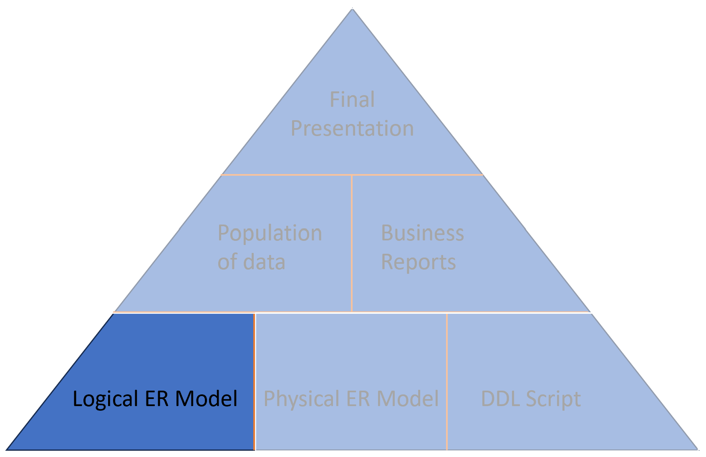

# Project Content

## Logical ER Model - Sprint 1

In this sprint, you will be completing one of the foundational layers of the project, contributing an incremental value towards the final project.

### Deliverable

You are required to submit a PDF containing the following:

1. **Logical Entity Relationship Model (ERD)**:
    - **Minimum of 8 strong entities** with their names.
    - All relationships must be defined as either 0:1, 1:M, or 0:M. 
    - No need to break down M:N relationships yet or show the associative entity.
    - **Attributes**:
        - Each entity should have at least 4 attributes.
        - At least one identifier per entity.
    - **Entity Breakdown**:
        - One entity should break down into at least two categories (e.g., an entity `STUDENTS` breaking down into `INTERNATIONAL` and `DOMESTIC`).

2. **Explanations of Relationships**:
    - Explain each relationship, providing an example of data.
    - Example: If you have an entity `students` and an entity `courses`, explain that a student can take many courses, and a course can be taken by many students, which would lead to an associative entity like `enrollment`.

3. **Example Data**:
    - For example, if you have an entity `courses` with attributes such as `course_id`, `course_name`, `course_credits`, and `course_program`, your example of data could look like this:
        - `OPIM5272, Data Management and Business Process Modeling, 3, {MSBAPM/MBA/FINTECH}`

4. **3 Possible Reports**:
    - List 3 possible reports that you will generate from your database. Examples of reports could include:
        - Total sum of students per course.
        - Total number of students enrolled in two specific courses.

### ERD Design Tools

You can design the ERD using tools such as:
- **draw.io**
- **Lucidchart**
- **Visio**

Make sure:
- **All connections** (connectivity and cardinalities) are as large as possible.
- **Font size** should be at least 12.
- Provide **clear screenshots** of your diagrams in the PDF submission.

### Submission Format

Submit the deliverable in **PDF format**.
