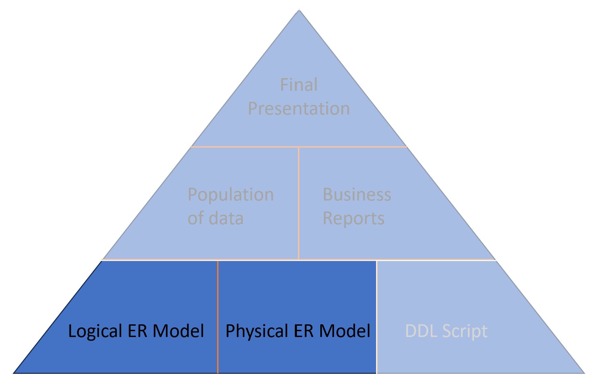

# Project Content

## Physical ER Model - Sprint 2

In this sprint, another incremental value piece is completed. The **Physical Entity Relationship (ER) Model** demonstrates how the database will be created by a 'developer' (you). This model includes:

- **Entities and their names**.
- **Attributes**, with appropriate and meaningful data types (domain).
- **Relationships**, broken down to one-to-many (1:M) relationships, resolving any many-to-many (M:N) relationships.
- Appropriate **foreign keys (FK)** and **primary keys (PK)**.

 

### Enhanced Entity Constructs

In this updated model, include enhanced entity construct(s). In your previous submission, you identified at least one entity that can be broken down into two or more categories. For example, if you had a `STUDENT` entity, it could be categorized into `INTERNATIONAL` and `NATIONAL` students (or more subtypes in your case).

- Modify this entity to reflect the enhanced entity construct based on the rules you've studied.
- **Include a minimum of 2 subtypes**.
- Label the **completeness** and **disjointness constraints** properly.
- Ensure you have the correct **subtype discriminators**.
- Use proper **primary keys (PK)** and **foreign keys (FK)** in both the **supertype** and the **subtypes**.

### Additional Requirements

- **Resolve any many-to-many (M:N) relationships**: Ensure that any M:N relationships are properly broken down and resolved.
  
- **Data Types**: 
  - Include all data types in your updated physical ER model.
  - Make decisions on the type of data each object will hold, ensuring that you appropriately use the three main data types:
    - **String**
    - **Numeric**
    - **Date and Time**
